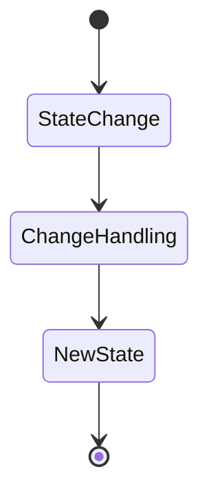

## Игровое правило (GameRule)

GameRule — это центральный компонент, который инкапсулирует всю бизнес-логику игры. Именно правила определяют, как игрок прогрессирует, получает награды, достигает победы или поражения.

### Когда выполняется правило ?

Как и в реальной игре, правила выполняются только при определённых условиях, например, при изменении состояния Entity, Scene или после выполнения Action. Однако если проходить по всем правилам (их может быть не мало) и проверять их условия при каждом изменении состояния, это может ударить по производительности, поэтому была введена система триггеров.

**Триггер** — это ключевое условие, вынесенное из общего списка условий в отдельную индексированную структуру для последующей быстрой проверки в массиве.

Пример триггеров:

* **Action Trigger** - запускается, когда выполняется [действие](./action.md)

* **Scene Trigger** - запускается, когда меняется [сцена](./scene.md) игры.

* **Parameter Trigger** - запускается при изменении параметра.

### Pipeline

Теперь наши правила могут выполняться, но осталась еще одна проблема:
Допустим, правило победы срабатывает при достижении игроком 10-го уровня. Но когда это условие выполнено, откуда взять этого самого игрока? 
Для этого используется Pipeline: он находит нужного игрока, вызывает правило и передаёт в его контекст параметр player_with_level_10. Теперь правило может получить объект игрока из контекста по этому ключу.

```csharp
//Это могло бы выглядить как то так:
void Build(IPipelineBuilder builder)
{
    builder.AddMiddleware((context) =>
    {
        var player = context.FromEntity<Player>()
                            .FromParameter(Level)
                            .FirstOrDefault(x => x.Value >= 10);

        context.AddCondition(player);
        context.AddParameter(_winnerKey, player.Value);
    });
}

```

Pipeline можно назначить как для конкретного правила, так и глобально — для группы правил.
*Например*: правило **Ability (Умение)** добавляет игроку специальное [действие](./action.md) при выполнении условий. Для всех Ability мы можем использовать глобальный Pipeline, добавляющий общую логику типичную для данного множества правил.

*Примечание*: 
За одно изменение состояния игры может быть выполнено несколько правил, так что стоит задуматься об очереди выполнения с приоритетом.

### Accessors

Сами по себе правила не изменяют состояние игры напрямую, они используют для этого accessor'ы.
 **Accessor** - это прослойка между состоянием игры и правилами, которая предоставляет безопасный доступ к данным без возможности их прямого изменения.

##### Преимущества подхода
* Избежание race condition: К примеру Правило 1 требует конкретного значения ресурса A для выполнения, но в это же время правило 2 может изменить этот ресурс А, хотя правило 1 уже начало выполняться.

* Очерёдность действий:



Так получается, что новые правила выполняются **только после полного выполнения текущего правила**, что гарантирует предсказуемость игрового состояния, а также это позволяет легко следить за изменением состояния.

### Контекст выполнения
Для взаимодействия с состоянием правила используют контекст выполнения (RuleExecutionContext). Сам по себе контекст представляет собой набор accessor'ов для доступа к игровому состоянию.